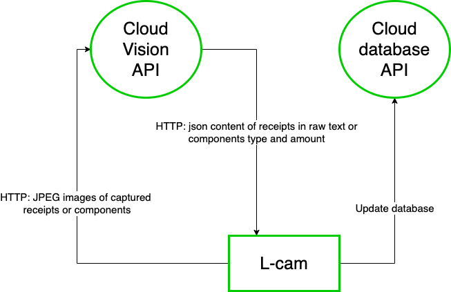
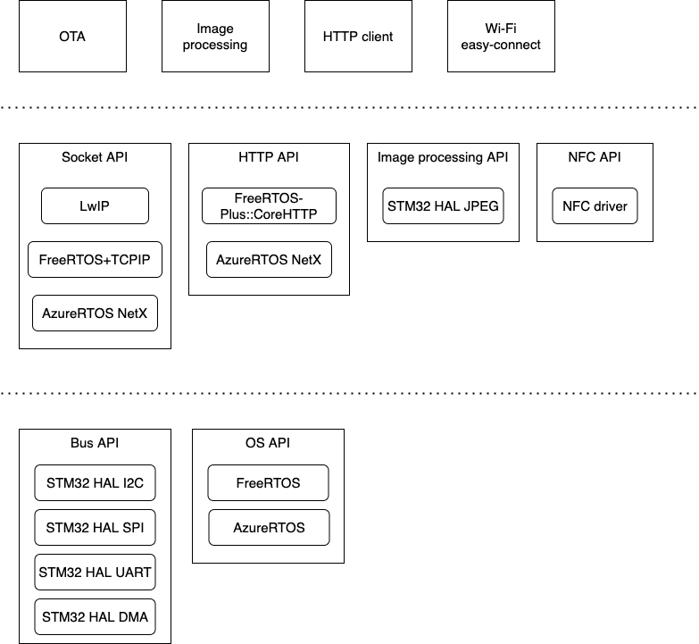
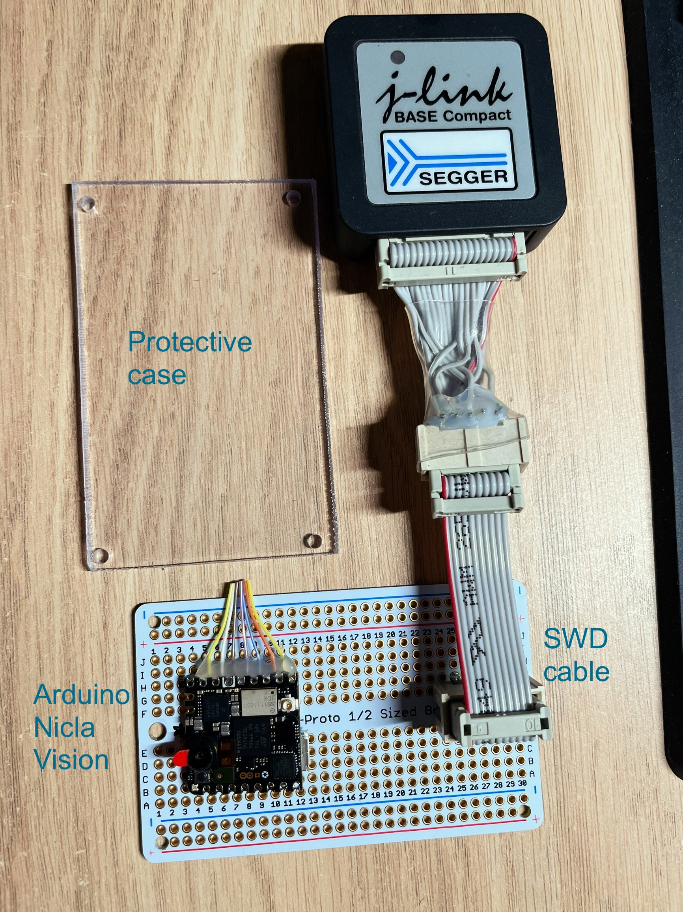

# L-cam

## What is L-cam

In a hardware startup company, saving cost of prototyping is always essential.
L-cam helps to do it better by:
* Scanning order receipts then instantly update to database of internal stock.
* Monitor internal stock in real-time to update the amount of parts that are supplied or consumed.
=> So no more:
* Duplicated order because missed tracking internal stock.
* Delayed prototyping team because of out of dated internal stock which leads to late order.

Why "L" in L-cam?
My mother called me Luck when I was born so I take that name when I work abroad.
L means Luck!

## Architecture
*Overview*

*Embedded Software Architecture*

## Early prototype

*Prototype as of Oct 31, 2022*

